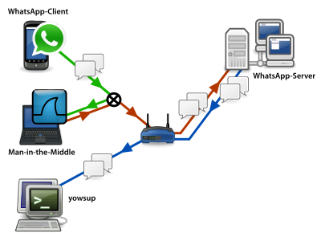

Problem früher:

* nur Nachrichten zwischen Android-Geräten verschlüsselte
* Für den Nutzer nicht erkennbar, welche Nachrichten verschlüsselt wurden und welche nicht die verwendeten Krypto-Schlüssel konnten nicht geprüft werden
* → Man konnte sich nicht auf die Sicherheit einzelner Gespräche nicht verlassen

April 2016

* Verschlüsselung für alle freigeschaltet
* Verschlüsselung für Nachrichten, Anhänge und Gruppenchats

Test von HeiseSecurity

* verschlüsselt WhatsApp unabhängig vom Gerät des Empfängers?
* Verschlüsselung an sich haben wir keinem Test unterzogen!

Testaufbau

<small>Quelle: heise.de</small>

* yowsup (mehr Informationen über den Ablauf der Kommunikation und das eingesetzte Protokoll zu Tage zu fördern)
* yowsup Modifiziert, so dass sowohl der ciphertext als auch der entschlüsselte Text ausgegeben werden – damit sieht man wann verschlüsselt ist und wann nicht.
* Web-Client wurde NICHT getestet

Erkenntnisse
* Aufbau verschlüsselter Chats hatte Probleme (evtl. weil Server überlastet)
* Client erstellt Pre-Keys und ladet diese auf den WhatsApp Server hoch
* Bekommt Client Kartext, so antwortet er auch mit Klartext-Nachricht
    - Wird auch korrekt angezeigt!
* Sobald einmal verschlüsselt kommuniziert wurde war Downgrade auf Plaintext nicht mehr möglich
* Whatsapp gibt Warnung an, wenn Key geändert wurde (falls eingeschaltet)

Fazit
* Konsequente End-to-End verschlüsselung
* Gut im UI integriert
* Möglichkeit, den Key des Gegenübers zu prüfen
* Über Änderungen an diesen Schlüsseln wird man KANN man benachrichtigt werden
* Für User nur ein Update: Gewinn für die Privatsphäre
* Problem: Whatsapp ist nicht OSS
* Whatsapp sammelt nach wie vor Metadaten (ist aber schwer * nicht mitzubekommen!)

Versprechen von Moxie Marlinspike
* Plaintext-Kommunikation im WhatsApp-Netz komplett abstellen
